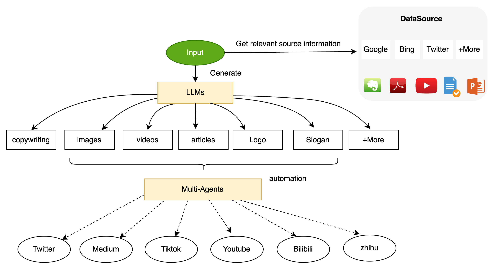

# OperateGPT: 一句话需求即可完成运营的变革
<div align="center">

[**English**](../README.md) |[**文档**](http://operategpt.cn/web/#/602177878/152973408)|
</div>

- 利用大语言模型和多智能体技术，通过一行需求自动生成运营文案、图片和视频，一键发送多个平台实现快速运营的变革




## 支持的运营平台

| Operate Platform | Supported   | API           | Notes |
|------------------|-------------|---------------|-------|
| YouTube          | Coming soon | Coming soon   |       |
| Twitter          | Coming soon | Coming soon   |       |
| CSDN             | Coming soon | Coming soon   |       |
| B站               | Coming soon | Coming soon   |       |
| 知乎               | Coming soon | Coming soon   |       |
| 微信               | Coming soon | Coming soon   |       |
| 豆瓣               | Coming soon | Coming soon   |       |
| 抖音               | Coming soon | Coming soon   |       |

## 支持的大语言模型

| LLM             | Supported    | Model Type   | Notes |
|-----------------|--------------|--------------|-------|
| ChatGPT         | Yes          | Proxy        |       |
| Bard            | Yes          | Proxy        |       |
| Claude          | Coming soon  | Proxy        |       |
| Vicuna-13b-v1.5 | Coming soon  | Local Model  |       |
| ChatGLM2-6B     | Coming soon  | Local Model  |       |
| Qwen-7b-Chat    | Coming soon  | Local Model  |       |

## 支持的文本嵌入模型

| LLM                      | Supported    | Notes |
|--------------------------|--------------|-------|
| all-MiniLM-L6-v2         | Yes          |       |
| text2vec-large-chinese   | Coming soon  |       |


## 安装

首先，下载相关模型
```commandline
mkdir models & cd models

# 下载embedding 模型，默认all-MiniLM-L6-v2，对于中文可以使用text2vec-large-chinese
git lfs install 
git clone https://huggingface.co/sentence-transformers/all-MiniLM-L6-v2

# 下载stabediffusion模型 (git仓库94GB，模型47GB), 推荐使用stablediffusion-proxy, 参考 https://github.com/xuyuan23/stablediffusion-proxy
git lfs install 
git clone https://huggingface.co/stabilityai/stable-diffusion-xl-base-1.0
```

下载安装python项目依赖包，并启动项目

``` commandline
# 安装python依赖包
pip install -r requirements.txt

# 复制.env.template文件内容到新创建的.env文件中，并修改.env文件中的内容
cp .env.template .env 

# 启动stablediffusion服务, 如果使用了StableDiffusion代理，则无需执行!
python operategpt/providers/stablediffusion.py

# 执行项目，将会生成一个markdown文件 /data/operation_data/xxx.md
python main.py "what is MetaGPT?"
```

## 配置
- 默认使用ChatGPT作为LLM, 首先你应该在`.env`中设置`OPEN_AI_KEY`， StableDiffusion使用代理则需要设置，否则需要在本地启动

```properties
OPEN_AI_KEY=sk-xxx

# 如果你没有部署StableDiffusion，则无法生成图像
SD_PROXY_URL=127.0.0.1:7860
```

## 内容展示
- 下面的内容完全是由OperateGPT生成: http://operategpt.cn/web/#/602177878/0

- 视频

https://github.com/xuyuan23/operateGPT/assets/26043513/bd585d00-f793-443d-a395-532d0c038e97