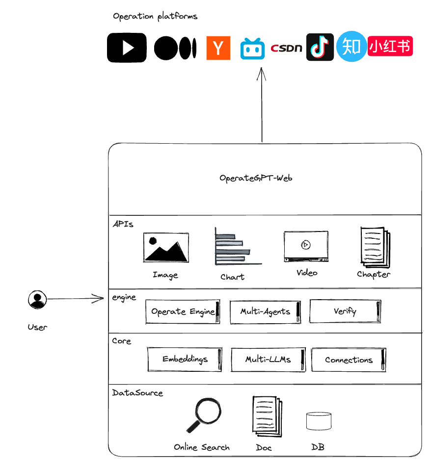

# OperateGPT: Revolutionize Your Operations with One-Line Requests

[Experience Now!](http://dev.operategpt.cn)

## Professional Terminology

**Agent**: A system that autonomously understands, plans, and executes complex tasks.

**Multi-Agents**:  A system where multiple agents share memory and autonomously complete tasks.

**Embeddings**: Text embeddings, which convert text into vectors stored in a vector database to enable similarity-based searching of document contents.

**Connections**: Data source connections, such as methods for connecting to different types of databases or retrieving information from PDF, PPT, and Excel documents.

**OperateEngine**: Engineering implementation for generating prompts for operational content, aggregating summaries, conducting audits, and publishing on operational platforms.

## Architecture



## How operateGPT works?

**Using large language models and multi-agent technology, operational copies, images, and videos can be automatically generated based on a single-sentence requirement. With one-click adaptation and distribution to multiple platforms, fast and efficient operations can be achieved.** 

### Data Source

Automatically identifying data sources based on user requirements can come from various types of data, including:
- Internet: All web resources accessible on the Internet can be queried through relevance searches and serve as the default recognized data source.
- Databases: User database data, considered private data, can be combined with operational requirements to achieve intelligent business intelligence (BI) and generate analytical charts.
- Audio/Video: By considering the relevance to operational scenarios, audio and video content can be automatically embedded into operational reports.
- Images: By considering the relevance to operational scenarios, images can be automatically embedded into operational reports.
- Local Documents: After embedding local document materials into a vector database, they can be used for knowledge-based question answering and serve as an important source of aggregated data for operations.

### Data Summary

Based on operational requirements, relevant data can be queried and further analyzed and summarized from various data sources:
- URL Data: Relevant top web page data with strong relevance can be queried from websites and platforms such as Google, Baidu, Bing, etc. By splitting the data into chunks, embedding it, and generating vector data, the most strongly related content can be identified through similarity searches and used as the foundational data for generating copies.
- Databases: By combining operational requirements with business scenarios, SQL can be generated to query relevant data from RDB/NoSQL databases and generate reports. The report data will be embedded as part of the operational data.
- Local Documents: Searching from the vector database.

### Content Generation
- Using the Prompt framework, a portion of the aggregated data, along with some characteristics of the entities and scenarios, can be extracted. StableDiffusion or Midjourney can then generate images, while Gen-2 or open-source video models can generate video content.
- Leveraging the Prompt framework, existing operational summaries, analytical reports, images, and videos can be intelligently combined to quickly generate articles, videos, web pages, and other content that align with operational requirements.
- Considering the platform's characteristics, content generation can be adjusted accordingly. For example, video traffic platforms like Bilibili and Douyin focus on video generation and can embed operational content into videos, while platforms like Zhihu and CSDN combine text and images to generate copy.

### Content moderation
Operational data requires review before it can be published, and the simplest way to conduct the review is by training the LLM on content moderation guidelines to enable intelligent review.
- Content quality review
- Content legality and compliance review
- Sensitive data review

### Publish to the operations platform
- One-click multi-platform publishing
- Account management

## Installation

**Pure text operation copywriting**

```commandline
git clone https://github.com/xuyuan23/operateGPT.git
pip install -r requirements.txt

# Download the embedded model.
mkdir models & cd models
git lfs install 
git clone https://huggingface.co/sentence-transformers/all-MiniLM-L6-v2

# Configuration: Copy the following content and modify OPEN_AI_KEY={your-openai-key}.
cp .env.template .env 

# startup
python main.py "Travel itinerary to Chengdu"
```

**Copywriting with AI-generated images, additional services needed to be supplemented below**
```commandline
# Requires 16GB of RAM or VRAM to run locally.
git lfs install 
git clone https://huggingface.co/stabilityai/stable-diffusion-xl-base-1.0
python operategpt/providers/stablediffusion.py

## Alternatively, you can deploy the agent on the cloud, https://github.com/xuyuan23/stablediffusion-proxy
```

**Copywriting with AI-generated videos, additional services needed to be supplemented below**

```commandline
git lfs install
git clone https://huggingface.co/cerspense/zeroscope_v2_576w
python operategpt/providers/text2video.py

# Alternatively, you can deploy the agent on the cloud, https://github.com/xuyuan23/Text2Video
```

