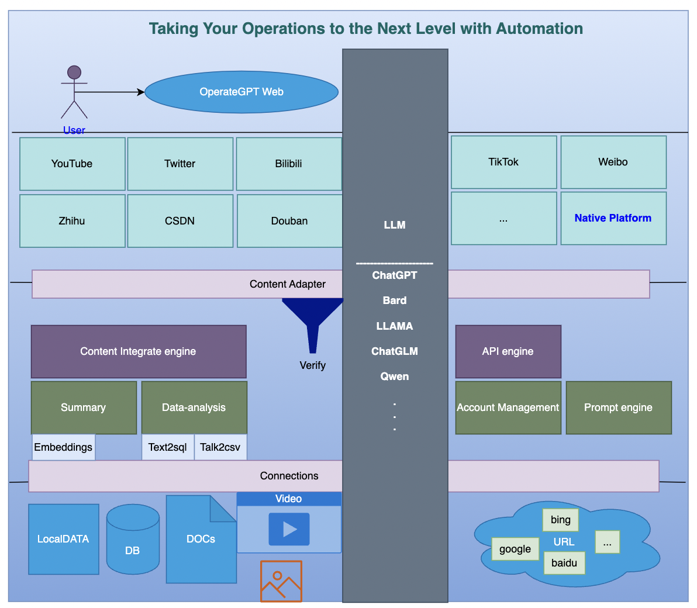

# OperateGPT：一句话需求即可完成运营

- 利用大语言模型和多智能体技术，通过一句话需求自动生成运营文案、图片和视频，一键适配发送多个平台实现快速运营的变革。

## OperateGPT技术架构

### 1. 数据源
根据用户需求自动识别数据源，可能来源于下面各种数据：
- Internet网页数据：因特网上的所有能访问网页资源，都可以通过相关性搜索查询，作为默认识别的数据源
- 数据库：用户数据库数据作为私有数据，结合用户运营需求完成智能BI，生成分析图表
- 音/视频：结合运营需求场景相关性，可自动嵌入到运营报告中
- 图片：结合运营需求场景相关性，可自动嵌入运营报告
- 本地文档：本地文档资料Embedding之后存储至向量数据库，支持知识库问答, 也可以作为运营的重要汇总数据来源 

### 2. 数据汇总
根据运营需求，从各个数据源中查询相关数据做进一步分析和汇总。
- URL数据：可以从google，百度，bing等网站和平台查询相关性较强的top网页数据，通过将这些数据切分成块之后Embedding，生成向量数据，再通过相似度搜索查询关系型最强的一些内容作为文案生成的基础数据。
- 数据库：结合运营需求与业务场景，生成SQL从 RDB/NoSQL数据库中查询相关数据生成报表，报表数据将作为运营数据的一部分嵌入
- 本地文档：从向量数据库搜索

### 3. 内容生成
- 通过Prompt工程从汇总数据提取一部分事物和场景以及其具备的一些特性，由StableDiffusion或者Midjourney生成图片，从Gen-2等生成视频内容
- 通过Prompt工程将现有的运营汇总内容、分析报表、图片、视频智能组合，快速生成符合运营需求的文章/视频/网页等
- 结合平台特性对生成内容做偏向调整，例如B站、抖音等视频流量平台专注于视频生成，将运营内容嵌入到视频中；知乎、CSDN等平台多结合图文内容生成文案

### 4. 内容审核
运营数据需要审核才能发布，最简单的审核方法就是让LLM学习内容审核条约实现智能审核
- 内容质量审核
- 内容合法合规审核
- 敏感数据审核

### 5. 平台推送
- 一键推送多平台
- 账号管理

