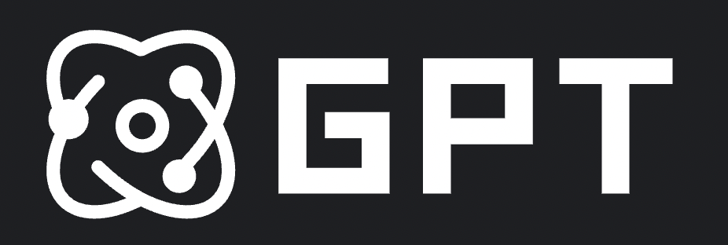
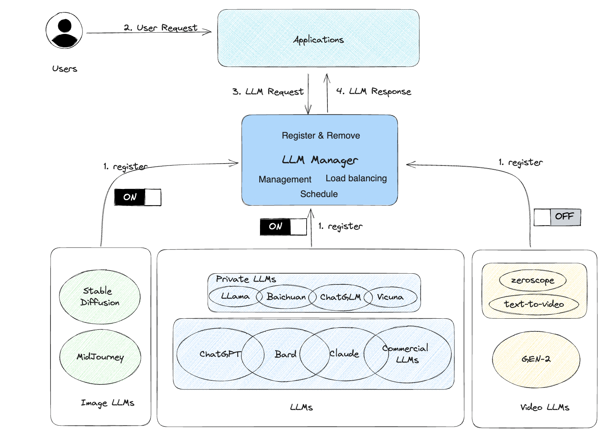

# 多模型管理



## 一、为什么要做多模型管理？
在LLMs百花齐放的时代，大量的模型涌现出来，不仅仅是大语言模型，还有很多图像生成模型，视频生成模型，甚至是多模态模型，项目中使用的模型也不可能只有一种，更不可能只有一个。很可能是x个LLM_A, y个LLM_B, z个LLM_C这样的复杂组合，在实际业务场景中将会面临大量要解决的问题。
- 如何实现多个模型调度？
- 如何实现负载均衡？
- 如何做推理服务健康管理？
- 如何快速接入三方模型？
- 如何实现模型免适配的快速共享？
- 如何...

大量的场景和诉求驱使了多模型管理的诞生。


## 二、架构

### 2.1 多模型现状

- 目前较好的私有化大语言模型有Llama系列，ChatGLM系列，Baichuan系列。而对于商用大模型如ChatGPT, Bard, Claude这样的模型，推理成本低于私有化部署的模型并且远优于私有化部署的模型，用户也会通过Proxy的形式轻量级接入。


- 图像模型目前表现不错的有商用模型Midjourney, 以及开源模型StableDiffusion, 最新的StableDiffusion模型参数近50GB，支持在8GB显卡上推理，CPU推理较慢。


- 视频模型目前表现较好的有商用模型Gen-2, 其他开源视频模型目前效果都比较差，伴随着多模态模型的高度关注下，也在快速推进，效果在不断变好。

### 2.2 AI大模型特点

私有化推理服务部署成本高昂，动就需要几十GB的内存和GPU显存，多模型部署基本上都是通过服务API管理，而商用大模型也会通过API的形式接入，所以完全可以基于推理服务API构建多模型管理系统。

### 2.3 多模型管理架构




## 三、多模型管理API

### 3.0 启动服务

- 可移植代码模块点[这里](../../operategpt/llms)

```commandline
# 启动模型管理服务（也可以将API绑定到自己的应用服务中）
python operategpt/llms/worker_manager.py

# 【如果你已经有模型服务则可选】启动模型服务，需要配置一些相关参数，参考model_config.py文件
python operategpt/llms/llmserver.py
```

### 3.1 模型注册：
- 模型注册需要将API注册到LLM框架服务中进行管理， 其中注册的关键参数需要选择性替换， 一般只需要替换{USER_PROMPT}

```commandline
response_extract: 采用a.b[].c的形式表示提取 `response["a"]["b"][0]["c"]`
owner是模型的拥有者
req_url_template 是推理了服务的url模板
model_name是模型名，多个同名的模型将会被负载均衡的调用
body是请求体
注册模型时，需要将模型请求的部分参数修改成以下枚举类的对应值，{USER_PROMPT}是必须映射的，其他可选:
    USER_PROMPT = "{USER_PROMPT}"
    MODEL_TEMPERATURE = "{MODEL_TEMPERATURE}"
    MODEL_NAME = "{MODEL_NAME}"
```

示例：将一个大模型推理服务注册到模型管理器: 
```commandline

# 注册请求
curl -X POST -H "Content-Type: application/json" -d '{
    "model_name": "proxyllm",
    "body": {
        "input": "{USER_PROMPT}",
        "model_name": "{MODEL_NAME}"
    },
    "req_url_template": "http://127.0.0.1/api/generate",
    "owner": "xuyuan23",
    "response_extract": "data.items[].attributes.answer"
}' http://127.0.0.1:8007/api/server/register


# 返回结果
{
    "success": true,
    "msg": "register LLM proxyllm succeed!"
}

```


### 3.2 模型查询

```commandline

# 查询请求
curl http://127.0.0.1:8007/api/server/workers

# 返回结果

{
    "success": true,
    "data": [
    	{"model_name": "chatglm2-6b", "req_url_template": "https://xxx/openapi/xxx/inference/query"}, 
    	{"model_name": "proxyllm", "req_url_template": "http://localhost:8008/generate"}
    ]
}

```


### 3.3 模型下线

```commandline

# 发起下线请求
curl -X POST -H "Content-Type: application/json" -d '{
    "model_name": "chatglm2-6b",
    "req_url_template": "https://xxx/openapi/xxx/inference/query"
}' http://127.0.0.1:8007/api/server/offline


# 返回结果
{
    "success": true,
    "msg": "remove llm worker(model_name=chatglm2-6b, url=https://xxx/openapi/xxx/inference/query) succeed!"
}
```


### 3.4 模型推理

```commandline

# 模型请求1
curl -X POST -H "Content-Type: application/json" -d '{
    "input": "who are you?",
    "model_name": "chatglm2-6b"
}' http://127.0.0.1:8007/api/v1/chat/completions

# 返回数据1
{
    "success": true,
    "msg": "execute succeed",
    "result": "Hey there! My name is Noxix, and I am an AI chatbot designed to have conversations with users like you. How can I assist you today?"
}


# 模型请求2
curl -X POST -H "Content-Type: application/json" -d '{
    "input": "who are you?",
    "model_name": "proxyllm"
}' http://127.0.0.1:8007/api/v1/chat/completions

# 返回数据2
{
    "success": true,
    "msg": "execute succeed",
    "result": "I am an AI language model developed by OpenAI. I am programmed to provide information and assist with various tasks. How can I help you today?"
}

```

## 四、代码

[OperateGPT多模型管理/llms目录](https://github.com/xuyuan23/operateGPT/tree/master/operategpt/llms)
